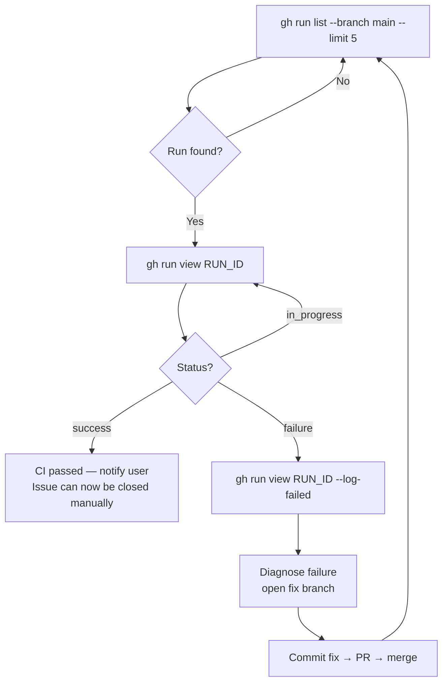

## Watch CI

Monitor the main branch CI run after a PR merges:

**Rules:**
- Never trigger a re-run via `gh workflow run` or `gh api`
- Only observe; fixes go through a new PR
- Report the run URL and job summary to the user when done
