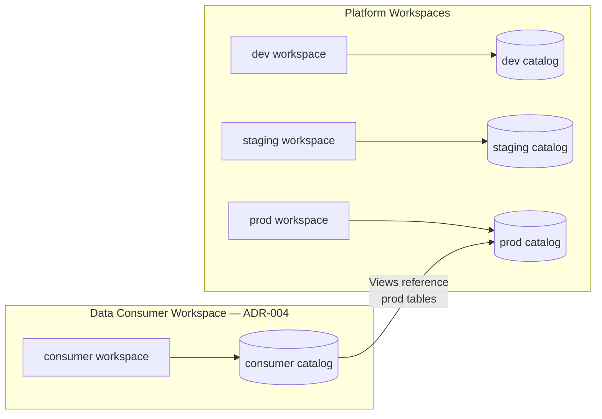
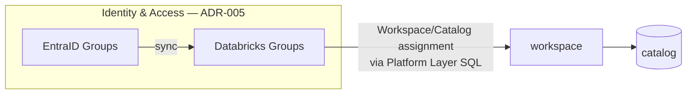
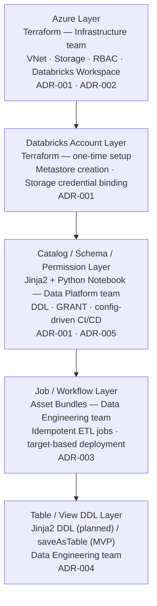
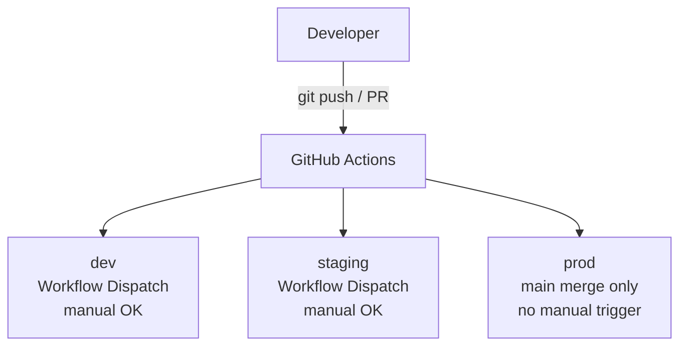

# Databricks Mock Platform

> A portfolio-grade reference architecture demonstrating how to design and operate a Databricks Data Platform — with a focus on **architectural decision-making**, not just tool usage.

-----

## What This Is

This repository is not a tutorial. It is an opinionated, constraint-aware implementation of a Databricks Data Platform on Azure.

**What it demonstrates:**

1. **Layered ownership thinking** — not "how do I use Terraform" but "what should Terraform own and why"
1. **Constraint-aware design** — decisions are made for a team with mixed tooling maturity, not an ideal greenfield org
1. **Decision documentation habit** — ADRs exist so future maintainers (and hiring managers) can understand the *why*, not just the *what*
1. **CI/CD discipline** — execution path policy is explicit and enforced, not just recommended
1. **Trade-off literacy** — each major choice includes what was rejected and why

The design intentionally reflects a common scenario: **a low-to-mid maturity organization** where infrastructure, data platform, and data engineering teams have different tooling capabilities and different incentives. The goal is to find the minimum viable architecture that is still principled.

-----

## Architecture Overview

### Workspace & Catalog Structure (Target State)

### Identity & Access (Target State)

> **Current status:** Single workspace, single catalog (MVP). Multi-workspace structure above is the target design. See [Current Status (MVP)](#current-status-mvp) for details.

### Layer Separation (within each Workspace)

### Why This Layering?

Each layer has a different **rate of change**, **team ownership**, and **failure blast radius**. Mixing them into a single tool or pipeline creates hidden coupling that eventually breaks — usually in production, usually at the worst time.

See the [Architecture Decision Records](#architecture-decision-records-adr) section for the reasoning behind each boundary.

-----

## Tech Stack

|Category     |Tools                                                  |
|-------------|-------------------------------------------------------|
|Cloud        |Azure (Subscription, VNet, Storage, Entra ID)          |
|IaC          |Terraform                                              |
|Data Platform|Databricks (Unity Catalog, Asset Bundles, Delta Lake)  |
|Governance   |Unity Catalog — Metastore, Catalog, Schema, Permissions|
|Templating   |Jinja2 (SQL parametrization)                           |
|Orchestration|GitHub Actions                                         |
|Auth         |OIDC (GitHub Actions → Azure, no stored secrets)       |
|Languages    |PySpark, SQL, Python, HCL                              |
|Task Runner  |go-task (local command abstraction)                    |

-----

## CI/CD Design

### Execution Path Policy

**Key constraints enforced by design:**

- `prod` deployments are triggered only via merge to main — no manual runs, no exceptions
- `dev` and `staging` allow `workflow_dispatch` for exploratory testing, but still go through GitHub Actions (not local bundle run)
- Local `databricks bundle run` is disallowed in the current MVP phase — all execution history lives in GitHub Actions
- Planned next phase: `dev` local runs enabled via VS Code extension, scoped to per-developer namespaces (isolated catalog/schema per developer)

**Why ban local bundle run in Phase 1?**

Because local runs bypass the audit trail, can accidentally target non-dev environments depending on profile config, and create a class of "it works on my machine" incidents that are hard to debug. Establishing the CI/CD-first discipline first — then selectively relaxing it — is safer than trying to add guardrails retroactively.

**Why allow it in Phase 2 (dev only)?**

The VS Code Databricks extension enables deployment into a personal developer namespace (isolated catalog/schema per developer), which eliminates the environment collision risk. With that isolation in place, local runs in `dev` become low-risk and improve developer experience without compromising `staging` or `prod` integrity.

-----

## Architecture Decision Records (ADR)

Each ADR explains a key design choice, what was rejected, and why. Full rationale is in
[`docs/adr/`](docs/adr/).

### ADR-001: Terraform for Infra/Metastore, SQL for Catalog/Schema

Terraform owns Azure resources and the UC Metastore; Catalog and Schema are managed via
Jinja2-parametrized SQL notebooks owned by the Data Platform team. This boundary separates
infrastructure (slow-changing, infra team) from governance objects (frequently changing, data team),
eliminating the bottleneck of requiring infra involvement for schema changes. The trade-off is that
SQL-managed catalog has no Terraform drift detection, mitigated by idempotent DDL.

See [ADR-001](docs/adr/001-terraform-scope.md) for full rationale.

-----

### ADR-002: OIDC Authentication Only — No Stored Secrets

No stored secrets or service principal client secrets are used in GitHub Actions — all Azure
authentication uses OIDC federated identity. OIDC has no secret to leak, rotate, or forget; scope
is limited to the specific workflow and branch. This eliminates an entire class of
credential-management incidents at the cost of a one-time setup in Entra ID.

See [ADR-002](docs/adr/002-oidc-auth.md) for full rationale.

-----

### ADR-003: Idempotency as a First-Class Requirement

All DDL and DML operations must be idempotent by construction: `CREATE IF NOT EXISTS`, `MERGE`,
`mode("overwrite")` with explicit schema handling — no implicit assumptions about environment state.
This ensures that re-running a failed CI/CD job is always safe, with no manual cleanup required.
Idempotency is treated as a correctness property, not an optimization.

See [ADR-003](docs/adr/003-idempotency.md) for full rationale.

-----

### ADR-004: Data Consumer Workspace — View Layer Access Pattern

Data consumers are isolated from the platform prod workspace via a View layer in a dedicated
consumer catalog — a clean abstraction boundary without the cost overhead of Materialized Views.
Direct prod catalog access and full Materialized View isolation remain available depending on
governance requirements of each dataset. Materialized Views are intentionally avoided as the default
due to compute cost.

See [ADR-004](docs/adr/004-consumer-access.md) for full rationale.

-----

### ADR-005: Identity & Permission Model — Group-Based Access via EntraID Sync

Permissions are assigned to Groups only — never to individual users. All Metastore-scoped grants
(Workspace, Catalog, Schema) are managed via Jinja2 + SQL Notebook in the Platform Layer.
Group-based assignment ensures access is managed through a single source of truth and offboarding
propagates automatically. In production, groups are sourced from EntraID via Native Sync; in this
mock environment, Databricks-native groups are used as a simplification. EntraID Native Sync is
preferred over SCIM for its support of nested groups and lower setup complexity.

See [ADR-005](docs/adr/005-group-permissions.md) for full rationale.

-----

### ADR-006: Overwrite-Only Writes — Merge Pattern Deferred

The ETL pipeline uses `saveAsTable(mode("overwrite"))` for the silver layer and
`CREATE OR REPLACE VIEW` for the gold layer. `DeltaTable.merge()` (or SQL `MERGE INTO`) is
explicitly deferred: a correct merge implementation requires upstream primary-key enforcement,
a conflict-resolution strategy for late-arriving records, and an ingestion timestamp — none of
which exist in the current pipeline. The conditions under which merge becomes necessary (fact
tables, incremental loads, SCD Type 2) and the two candidate implementation paths (PySpark or
SQL/Jinja2) are documented in the ADR.

See [ADR-006](docs/adr/006-overwrite-only.md) for full rationale.

-----

### ADR-007: Wheel Packaging over `%run` for Shared ETL Code

Shared ETL code (`transform.py`, `catalog_lookup.py`) is distributed to Databricks clusters
as a Python wheel built via `pyproject.toml` and deployed via Asset Bundles `libraries`.
`%run` and naive relative imports are rejected: `%run` path resolution breaks silently across
environments, and Python relative imports do not work in Databricks notebooks (which are not
executed as packages). The wheel build step runs in CI on every PR, catching packaging failures
before they reach `bundle deploy`. Unit tests use an editable install on the GitHub Actions runner
— no cluster required.

See [ADR-007](docs/adr/007-wheel-packaging.md) for full rationale.

-----

## Production Considerations

These topics are not implemented in this mock environment due to cost and complexity constraints.
They are documented to demonstrate awareness of what a production-grade enterprise deployment
requires. Topics covered: VNet-per-workspace and hub-and-spoke topology, Storage Account
architecture (single vs multiple), and Serverless compute Network Connectivity Configuration (NCC).

See [`docs/design/production-considerations.md`](docs/design/production-considerations.md) for
the full write-up.

-----

## Current Status (MVP)

> **Live tracking:** [`docs/status.md`](docs/status.md) is the authoritative snapshot of open issues, pending actions, and architecture state. The section below is a high-level summary.

### Done

- Azure infrastructure provisioned via Terraform
- Databricks Workspace + Unity Catalog Metastore configured
- Catalog/Schema management via Jinja2 + Python Notebook (workload-catalog confirmed accessible 2026-03-08)
- Asset Bundles with environment-specific targets (`dev`, `staging`, `prod`)
- SDLC variable parametrization across environments
- GitHub Actions Workflow Dispatch for `dev`/`staging`
- ADR documentation (7 ADRs)
- MVP ETL pipeline using `saveAsTable` (bronze → silver → gold confirmed 2026-03-10)

### Deploying This Yourself

Full setup instructions, required secrets, common pitfalls, and the destroy/recreate procedure are in [GETTING_STARTED.md](./GETTING_STARTED.md).

-----

## Phase 2 Roadmap

> These items represent the planned next phase of development. Phase 1 (MVP) established the foundational layer separation, CI/CD discipline, and governance baseline. Phase 2 expands the platform toward a realistic multi-workspace, multi-team operating model.

### Developer Experience

| Item | Description |
|------|-------------|
| Local `bundle run` in `dev` | Enable via VS Code Databricks extension scoped to per-developer namespaces (isolated catalog/schema per developer). Eliminates environment collision risk while improving iteration speed. See [CI/CD Design](#cicd-design) for Phase 1 rationale. |
| Per-developer namespace isolation | Each developer gets a dedicated catalog/schema prefix in `dev` — prevents shared state collisions during local iteration. |

### Multi-Workspace Expansion

| Item | Description |
|------|-------------|
| `staging` workspace | Add a dedicated staging workspace and catalog. Currently only `dev` and `prod` targets exist in Asset Bundles. |
| `prod` workspace separation | Promote prod to a dedicated workspace (currently same workspace as dev, separated by catalog only). |
| Consumer workspace | Deploy the consumer workspace described in [ADR-004](docs/adr/004-consumer-access.md) — a separate workspace with a View layer over the prod catalog for business consumers. |

### Identity & Governance

| Item | Description |
|------|-------------|
| EntraID Native Sync | Replace Databricks-native groups with EntraID-synced groups. Native Sync supports nested groups and simplifies offboarding propagation. See [ADR-005](docs/adr/005-group-permissions.md). |
| Table/View DDL Layer | Implement the Jinja2 DDL layer for table and view definitions, currently shown as "planned" in the architecture diagram. Owned by the Data Engineering team. |

### Network & Security

| Item | Description |
|------|-------------|
| Private Endpoint for Storage | Add Azure Private Endpoint for the ADLS Storage Account (currently accessible over public endpoint with RBAC). |
| NCC for Serverless compute | Configure Network Connectivity Configuration to allow Serverless nodes to reach Storage via Private Endpoint. See [Production Considerations — Serverless Compute](#serverless-compute--network-configuration-ncc). |

### Observability

| Item | Description |
|------|-------------|
| Audit log pipeline | Forward Databricks audit logs to ADLS via Diagnostic Settings. Baseline for compliance and access review. |
| Job run history retention | Define a retention and export policy for GitHub Actions run logs and Databricks job run history. |

-----

## Blog Series

Detailed write-ups on specific decisions:

- [x] **[Why I Built a Mock Data Platform — and What the CI/CD Taught Me](https://platform-notes.hashnode.dev/why-i-built-a-mock-data-platform-and-what-the-ci-cd-taught-me)**
  *A design journal for Terraform + Databricks + GitHub Actions: Part 1 — Workspace & Metastore*
  Repo snapshot: [blog/cicd-part1](https://github.com/nobhri/azure-dbx-mock-platform/tree/blog/cicd-part1)

- [x] **[Terraform Stops at the Metastore — Managing Unity Catalog with Jinja2 and CI/CD](https://platform-notes.hashnode.dev/terraform-stops-at-the-metastore-managing-unity-catalog-with-jinja2-and-ci-cd)**
  *A design journal for Terraform + Databricks + GitHub Actions: Part 2 — Catalog & Schema*
  Repo snapshot: [blog/cicd-part2](https://github.com/nobhri/azure-dbx-mock-platform/tree/blog/cicd-part2)

- [ ] Terraform vs SQL for Unity Catalog Management — a real trade-off analysis
- [ ] Why I banned local `databricks bundle run`
- [ ] Asset Bundles parameter propagation: the bug and the fix
- [ ] Designing idempotent Databricks jobs
- [ ] OIDC authentication for Databricks on Azure — no secrets, no stress
- [ ] Terraform destroy and the cost incident: what I learned

-----

## Author

**Nobuaki Hirai** — Data Platform Architect / Data Engineer  
Working at the intersection of cloud infrastructure, data governance, and organizational constraints.

[GitHub](https://github.com/nobhri)  · [LinkedIn](https://www.linkedin.com/in/nobuaki-hirai-3776131b3)  · [Blog](https://platform-notes.hashnode.dev)

---

## License

MIT